## Section 1 - Installation of necessary software
  * **Hardware requirements**
    - 1x Raspberry Pi 4 kit with 2.5A Power Supply
    - 1x 64 GB micro SD Card
    - 1x SunFounder PiCar-V kit
    - 4x 18650 batteries and 1 x battery charger
    - 1x Google Edge TPU USB Accelerator
    - 1x 170 degree Wide Angle USB Camera
    - Legos & traffic set
    - USB Keyboard/Mouse and Monitor that takes HDMI input

  * **Raspberry Pi Hardware Setup**
    - Use the base operating system image from the following repository: https://github.com/google-coral/edgetpu-platforms. The image is labelled as “Raspberry Pi 4, Buster, Edgetpu 2.11.1”.
    - Follow this guide: https://www.youtube.com/watch?v=BpJCAafw2qE
    - Don’t forget to add the heat sinks!
  * **Rasbian OS Install**
    - Install the NOOBS Raspbian Operating System (a variate of Linux) onto a micro SD card using the CanaKit Raspberry Pi 4 Quick-Start Guide included in your kit
      - We want to use a custom OS, so go to this page: https://www.raspberrypi.org/downloads/4
      - Download the Raspberry Pi Imager for your respective OS (Windows, MacOS, Ubuntu)
      - 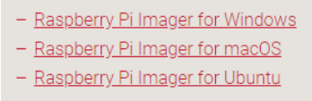
      - Download the Raspberry Pi 4, Buster, Edgetpu 2.11.1 Raspberry Pi OS from https://github.com/google-coral/edgetpu-platforms
      - 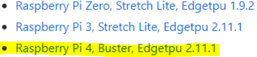
      - Run the Raspberry Pi imager and select “Use Custom” from the “Choose OS” dropdown menu
      - Select the Raspberry Pi 4, Buster, Edgetpu 2.11.1 OS as your custom OS
      - 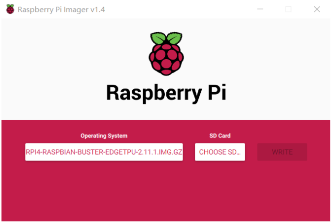
      - Next insert your SD card into the microSD reader and input it into your PC’s USB port
      - Choose the SD card from the “Choose SD” dropdown menu
      - 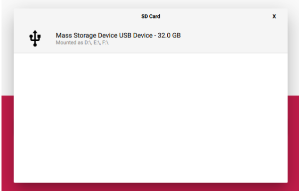
      - Click “Write” on the Raspberry Pi Imager
    - Install OS on Raspberry Pi
      - Insert the microSD into the Raspberry Pi
      - The Raspberry Pi should query you to do this at startup.  The Raspberry Pi 4, Buster, Edgetpu 2.11.1 OS should be saved on your Micro SD now
        - 4GB space required
        - Takes about 20min
    - Pi will request a password change.  Change password to pi
    - After the initial installation, Pi may need to upgrade to the latest software. This may take another 10–15 minutes.
      - In order to update software, you must connect the Pi to the internet.
      - First, update the device date/time by opening up the terminal and entering the following code with an updated date & time:
        - sudo date +%Y%m%d -s “20200912 10:00:00”
        - 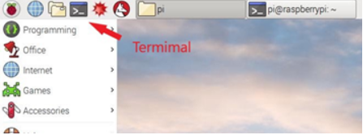
      - We must also expand the file system
      - Run raspi-config
      - Go to Advanced Settings
      - 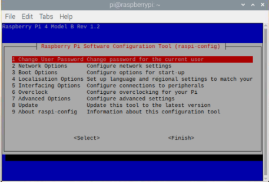
      - Select option 1 to expand file system
      - Reboot and run df -h in terminal
    - Now connect to your internet provider and accept the software update
    - You can also update the software manually in the terminal with the commands:
      - sudo apt update
      - sudo apt full-upgrade
    - If you run into issue related to insufficient file system space, go to the Expand File System section.
    - End result below
    - 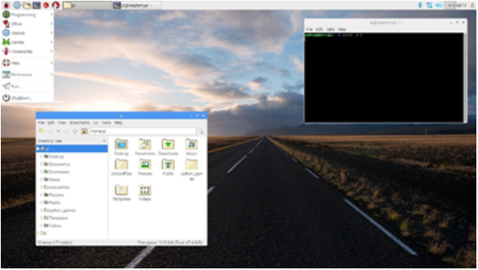
  * **Setup Remote Access**
    - Open the Terminal application
    - Run ifconfig in the terminal to find the Raspberry Pi’s IP address
    - Run sudo raspi-config in Terminal to start the “Raspberry Pi Software Configuration Tool”. You may be prompted to type in the password for user pi
    - 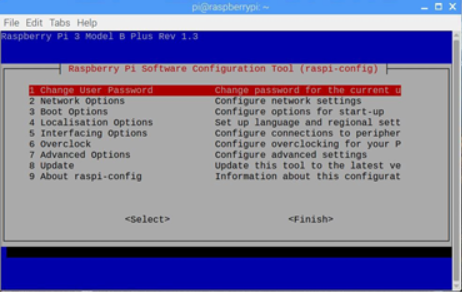
    - Enable SSH Server: Choose 5. Interface Options -> SSH -> Enable
    - Enable VNC Server: Choose 5. Interface Options -> VNC -> Enable
    - Download and install RealVNC Viewer onto your PC
    - Connect to Pi’s IP address using Real VNC Viewer
    - 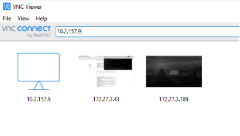
      - Enter the Pi’s username and password (User = pi   Password = pi)
      - 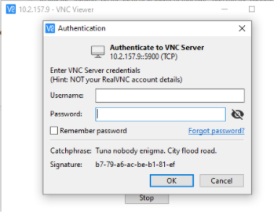
      - You will see the same desktop as the one Pi is running
    - Disconnect the monitor/keyboard/mouse from the Pi computer, leaving just the power adapter plugged in
   * **Setup Remote File Access**
     - In the Raspbian terminal run:
       - sudo apt-get update && sudo apt-get upgrade -y
       - sudo apt-get install samba samba-common-bin -y
         - Select “yes” when queried
       - sudo rm /etc/samba/smb.conf
       - sudo nano /etc/samba/smb.conf
     - Then paste the following lines into the nano editor:
       - [global]
       - netbios name = Pi
       - server string = The PiCar File System
       - workgroup = WORKGROUP
       - [HOMEPI]
       - path = /home/pi
       - comment = No comment
       - browsable = yes
       - writable = Yes
       - create mask = 0777
       - directory mask = 0777
       - public = no
       - 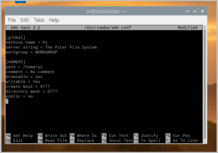
     - Save and exit nano by Ctrl-X, and Yes to save changes
     - Set the Samba Server password to pi.  After the password is set, restart the Samba server
       - \# create samba password
       - pi@raspberrypi:~ $ sudo smbpasswd -a pi
       - New SMB password:
       - Retype new SMB password:
       - Added user pi.# restart samba server
       - pi@raspberrypi:~ $ sudo service smbd restart
       - *** New password may not appear when typing in***
     - At this point, you should be able to connect to the Pi computer from your PC via Pi’s IP address (My Pi’s IP is 192.168.1.120). Go to your PC (Windows), open a Command Prompt (cmd.exe) and type:
       - net use r: \\192.168.1.120\homepi
       - r:
       - dir r:
     - We can now access the Raspberry Pi’s file system from our PC’s file manager
       - Note: If you have a mac this will be different.  Use the guide here: https://towardsdatascience.com/deeppicar-part-2-8512be2133f3
  * **Install USB Camera**
     - Take the USB Camera out of PiCar kit and plug into Pi computer’s USB port.
       - The device driver for the USB camera should already come with Raspian OS.
     - Run sudo apt-get install cheese from the terminal to install “Cheese”, the camera viewer. Yes
     - Launch Cheese app by clicking on the Raspberry Pi button(Top Left Corner)-> Sound & Video -> Cheese
       - You should see a live video feed displayed.
  * **SunFounder PiCar-V Software Configuration (Deviations from the manual)**
     - alias python=python3
     - alias pip=pip3
     - alias sudo='sudo '
     - cd
     - git clone https://github.com/dctian/SunFounder_PiCar.git
     - cd ~/SunFounder_PiCar/picar/
     - git clone https://github.com/dctian/SunFounder_PCA9685.git
     - cd ~/SunFounder_PiCar/
     - sudo python setup.py install
     - cd
     - git clone https://github.com/dctian/SunFounder_PiCar-V.git
     - cd SunFounder_PiCar-V
     - sudo ./install_dependencies
  * **PyCar Wheel Test**
     - pi@raspberrypi:~/SunFounder_PiCar/picar $ python3
     - import picar
     - picar.setup()
     - picar.front_wheels.test()
       - You should see the front wheels progressively turn left and right at different angles.
     - picar.back_wheels.test()
       - You should see the back wheels accelerate forward and then backwards.
<form>
 <input type="button" value="Go back!" onclick="history.back()">
</form>

