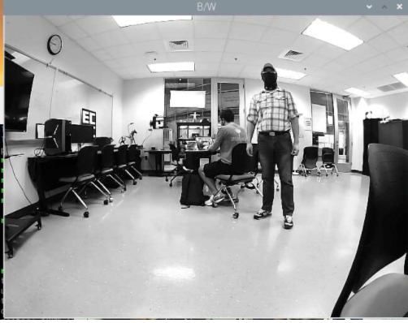
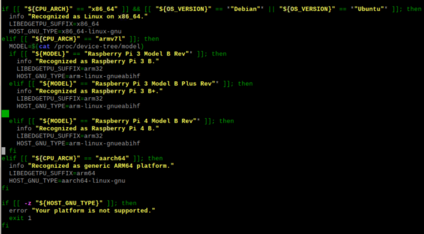
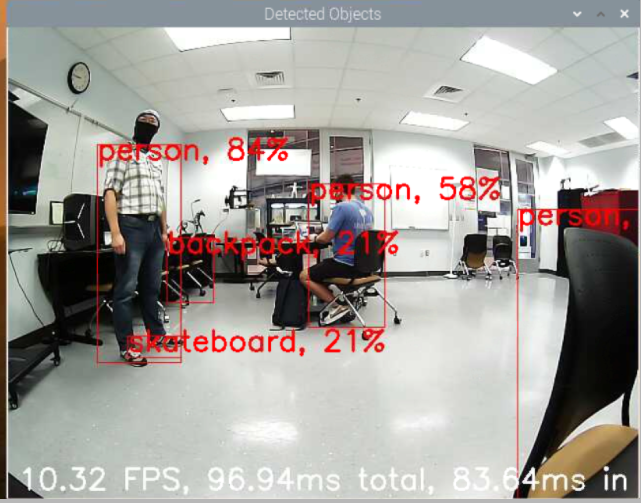

## Section 2 - Computer Vision Support
  * **Install OpenCV and Related Libraries**
    - Enter the following command into the Pi terminal
      - (make sure the date time is correct first, before running the next command)
      - sudo apt-get install libhdf5-dev -y && sudo apt-get install libhdf5-serial-dev -y && sudo apt-get install libatlas-base-dev -y && sudo apt-get install libjasper-dev -y && sudo apt-get install libqtgui4 -y && sudo apt-get install libqt4-test -y
      - pip3 install --upgrade setuptools
      - pip3 install scikit-build
      - pip3 install opencv-python
          - If this doesn’t work you may need to add scikit-build to PATH then try: 
              - pip3 install opencv-python
              - PATH=$PATH:/home/pi/.local/bin
              - This may reset at reboot but it works
       - pip3 install matplotlib
       - python3 -c "import cv2"
       - python3 -c "import numpy"
       - python3 -c "import matplotlib"
       - cd
       - git clone https://github.com/dctian/DeepPiCar.git
       - cd DeepPiCar/driver/code
       - python3 opencv_test.py
     - Here you should see output from your PiCar camera
     - 

 * **Installing TensorFlow**
     - cd
     - pip3 install setuptools --upgrade
     - sudo apt-get install -y libhdf5-dev libc-ares-dev libeigen3-dev
     - python3 -m pip install keras_applications==1.0.8 --no-deps
     - python3 -m pip install keras_preprocessing==1.1.0 --no-deps
     - python3 -m pip install h5py==2.9.0
     - sudo apt-get install -y openmpi-bin libopenmpi-dev
     - sudo apt-get install -y libatlas-base-dev
     - python3 -m pip install -U six wheel mock
        - Author’s note: This code came from the below link
        - https://raspberrypi.stackexchange.com/questions/107483/error-installing-tensorflow-cannot-find-libhdfs-so
      - pip3 install keras==2.3.1
  * **Installing Edge TPU Drivers**
     - cd
     - wget https://dl.google.com/coral/edgetpu_api/edgetpu_api_latest.tar.gz -O edgetpu_api.tar.gz --trust-server-names
     - tar xzf edgetpu_api.tar.gz
     - cd edgetpu_api/
     - sudo su root
     - sudo bash ./install.sh
       - You will get an error here if you are using a Raspberry Pi 4. This is the fix:
         - sudo nano install.sh
         - Add the Raspberry Pi 4 support at line 59:
         - elif [[ "${MODEL}" == "Raspberry Pi 4 Model B Rev"* ]];
         - info "Recognized as Raspberry Pi 4 B."
         - LIBEDGETPU_SUFFIX=arm32
         - HOST_GNU_TYPE=arm-linux-gnueabihf
         - Ctrl + X to exit. Save the changes. The new version of install.sh should be:
         - 
     - sudo bash ./install.sh
       - Would you like to enable the maximum operating frequency?
       - Y
     - sudo reboot now
  * **Run Live Object Detection**
     - cd ~/DeepPiCar/models/object_detection/
     - python3 code/coco_object_detection.py
     - 

<form>
<input id='submit' type="BUTTON" value="Section 1" onclick="window.location.href='https://larguncw.github.io/PyRoboCar/pages/section_1'">
</form>

<form>
<input id='submit' type="BUTTON" value="Homepage" onclick="window.location.href='https://larguncw.github.io/PyRoboCar/'">
</form>

<form>
<input id='submit' class="btn btn-primary float-right" type="BUTTON" value="Section 3" onclick="window.location.href='https://larguncw.github.io/PyRoboCar/pages/section_3'">
</form>

