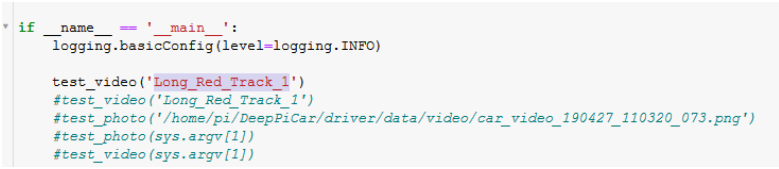
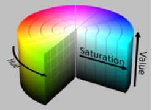

## Section 3 - Lane Keeping
  * **Running CV2 Video**
    - Download the record-video.py script from the following website.
      - https://github.com/codingforentrepreneurs/OpenCV-Python-Series/blob/master/src/lessons/record-video.py
      - I recommend placing it in the ~/DeepPiCar/driver/code directory for simplicity’s sake as that is where many of the other Python scripts you will use reside, but you do not need to do so.
      - The easiest way to download the record-video script is to do the following:
        - Move to the correct directory: cd ~/DeepPiCar/driver/code
        - Create/open a new vi file: vi record-video.py
           - You will see an open, empty vi file
        - Copy all the Python script in the above link by highlighting it and using point/click.
        - Move to the open vi file and paste the contents of the script into the vi file with point/click.  Afterwards, the file will look like the below.
        - 
        - Type :wq anywhere on the screen to write (save) the above file and quit (: is a special character that prompts an action command line).
      - Run the script with the following command: “python3 record-video.py”
      - 
        - The video will begin recording.  You should see a video screen pop up that shows the recording in real time.
      - Interrupt the Bash prompt by pressing CTRL-C when you are finished.
        - Or, press “q” to stop this program
        - The video will be saved as “video.avi”.  Rename the video as you wish.  Be cautious with running record-video.py because the script will overwrite the video file, destroying the previous video.
  * **Testing DeepPiCar code on your video**
    - Download the code below to your local PC (not the Raspberry Pi), use any Python IDE you are comfortable with:
      - https://github.com/Austin-Willoughby/School_Projects/DeepPiCar_Code.ipynb
      - You can save it as a .py file.
    - Move your video from the Raspberry Pi to your PC, and put the DeepPiCar_Code and the .avi video into the same folder.
    - Open the code and rename the string in the very last line to match the name of your video (e.g. mine is named “Long_Red_Track_1”)
    - 
    - Run the code
      - Your video should pop up in two new windows.  One window should show steering angle line overlays (hopefully) following the lane lines.  The other video should show the edges of your color mask
      - If the steering angle lines do not follow the lane lines (e.g. they are spastic and jump all over the screen) then most likely we need to tune your color mask to your particular track
      - Color tuning
        - Adjust the numerical HSV mask values in the arrays in the below code block
        - 
        - Note that there are 2 masks used because our red tape contains hues in both the 0-10 range and 170-180 range.  If you are not using red tape (or if your lighting is different) you may only need one mask
        - 
        - Use the feed displaying the edges of your color mask to determine how well your color mask is isolating your lane lines.  Mine looks like this:
        - 
      - Once you’ve tuned your color mask values and gotten acceptable steering angles you will need to save the changes to DeepPiCar.py on the Raspberry Pi
        - Move to the correct directory (if not already there): cd ~/DeepPiCar/driver/code
        - Type vi hand_coded_lane_follower.py
        - Copy/paste the modified code snippets (i.e. modified mask arrays) into the correct sections of hand_coded_lane_follower.py
        - Type :wq
        - We will run DeepPiCar.py, which uses the hand_coded_lane_follower.py
  * **Running the DeepPiCar**
    - If you are using Raspberry Pi 4, your hardware is not recognized/supported by SunFounder’s code, so follow there instruction here and add your Raspberry Pi version to the SunFounder’s code in PCA9685.py:
      -  This file could be in different places, please do a search:
         - find home/pi/* -name ‘PCA9685.py’
       - Add this line of to the supported Raspberry Pi versions in all the PCA9685.py:
         - RPI_REVISION_4_MODULE_B = ["c03111",”c03112”]
    - There is one bug that set the move direction to backward, to fix it:
      - The problem with the picar moving backwards when the deep_pi_car.py initiates was solved
        - The line ‘self.back_wheels.forward()’ was added at line 100 in the drive() function
        - The deep_pi_car.py was apparently defaulting to moving backwards in the absence of code dictating its direction.
        - Looking at the test() function in the back_wheels.py script, the picar’s wheels were directed to move forward before the wheels were given a speed
    - Set your PiCar on your track
    - Run the DeepPiCar_Code on your Raspberry Pi
      - The car should follow the lines
      - Move to the correct directory (if not already there): cd ~/DeepPiCar/driver/code
      - Type python3 DeepPiCar.py
      - Two screens should appear.  One is for object detection, one is for general viewing.
      - Once the picar completes the designated track, type CTRL-C on the command line to stop the DeepPiCar.py.
  
  

<form>
<input id='submit' type="BUTTON" value="Section 2" onclick="window.location.href='https://larguncw.github.io/PyRoboCar/pages/section_2'">
</form>

<form>
<input id='submit' style="position: relative; left: 1000px; top: 10px;" type="BUTTON" value="Section 4" onclick="window.location.href='https://larguncw.github.io/PyRoboCar/pages/section_4'">
</form>
