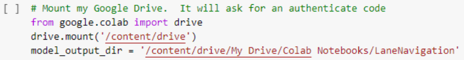
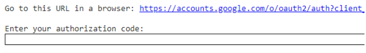
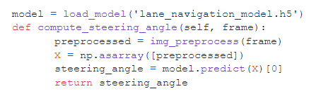

## Section 4 - Autonomous Lane Keeping
  * **Producing PyRoboCar Video Content**
    - Use the record-video.py script previously discussed in section 3 to record a video moving along the designated track
      - You will need to move the picar by hand.  Try to keep the picar as centered as possible on the track while moving.  This will form the training data that the future model is based on
    - Copy the video produced by the above script to the ~/DeepPiCar/models/lane_navigation/data/images directory.
      - cp ~/DeepPiCar/driver/code/[track video name] ~/DeepPiCar/models/lane_navigation/data/images/[desired track video name].avi
      - Meanwhile, if you see videos/image do not belong to you in this folder, delete them
    - Employ the save_training_data.py script to mark the image number and the steering angle of each image
      - CD to /DeepPiCar/driver/code folder
      - python3 save_training_data.py ~/DeepPiCar/models/lane_navigation/data/images/[track video name without “.avi”]
      - Left turn: turning angles should be <90
      - Right turn: turning angles should be > 90
    - Create a new folder in your Google Drive named ‘images’ and place the resulting images from the above in that folder
    - In Part 5 of the DeepPiCar instructions, click on the end-to-end deep learning lane navigation notebook
    - Click on the box that says “Open in Colab” in the top center of the page
    - Click on File>Save a copy in Drive
    - Open the copy of end_to_end_lane_navigation.ipynb now in your Google Drive
    - Replace the data_dir variable with the location of the above training images annotated with save_training_data.py.
      - If you just created a folder in Google Drive, the location is likely ‘/content/drive/My Drive/images’.  The ‘/content/drive/My Drive/’ location is the default main page in your Google folder
  * **Running the end-to-end deep learning lane navigation notebook**
    - You must first mount your Google Drive to Colab before you can access your Drive directory
    - Run this block of code
    - 
      - Note: you should have modified the directory to match yours
      - You will be queried to enter an authentication code
      - Click the link seen below and select the Google Drive account you want to link your Colab to
      - 
      - Once you’ve entered your Google Drive info input the given authentication code into the input bar in Colab
      - Your Google Drive should now be linked to Colab
    - You can now run all of Google Colab’s code blocks similarly to a Jupyter Notebook
    - Run all code blocks.  The model training block will likely take a few hours.  Make sure your computer doesn’t disconnect from Colab during this time
  * **Moving Trained Deep Learning Model to PiCar**
    - The end_to_end_lane_navigation.ipynb outputs the lane_navigation_model.h5 file into your designated Google Drive output directory
    - You must manually place the file in the model_path variable location referenced in the end-to-end-lane-follower.py file, which by default is /home/pi/DeepPiCar/models/lane_navigation/data/model_result/.  I don't recommend changing that
    - In order to test/run our model, we need to update the version of Tensorflow on our Raspberry Pi from 1 to 2. Instructions can be found at this link. Follow all of the instructions, except from the part regarding virtual environments. 
      - Run these commands in the command line
        - sudo apt-get install -y libhdf5-dev libc-ares-dev libeigen3-dev
        - python3 -m pip install keras_applications==1.0.8 --no-deps
        - python3 -m pip install keras_preprocessing==1.1.0 --no-deps
        - python3 -m pip install h5py==2.9.0
        - sudo apt-get install -y openmpi-bin libopenmpi-dev
        - sudo apt-get install -y libatlas-base-dev
        - python3 -m pip install -U six wheel mock
        - wget https://github.com/lhelontra/tensorflow-on-arm/releases/download/v2.3.0/tensorflow-2.3.0-cp37-none-linux_armv7l.whl
        - python3 -m pip uninstall tensorflow
        - python3 -m pip install  tensorflow-2.3.0-cp37-none-linux_armv7l.whl
      - Restart the raspberry pi
      - Type the following in the command line to check that the correct version of Tensorflow has been installed
        - python3
        - import tensorflow
        - tensorflow.__version__
       - This should output 2.3.0.
       - For future reference, if you want a version of Tensorflow different from 2.3, you can view and download releases here: https://github.com/lhelontra/tensorflow-on-arm/releases
     - Next run this Python code on the PiCar: 
     - 

<form>
<input id='submit' type="BUTTON" value="Section 3" onclick="window.location.href='https://larguncw.github.io/PyRoboCar/pages/section_3'">
</form>

<form>
<input id='submit' style="position: relative; left: 375px; bottom: 45px;" type="BUTTON" value="Homepage" onclick="window.location.href='https://larguncw.github.io/PyRoboCar/'">
</form>

<form>
<input id='submit' style="position: relative; left: 750px; bottom: 95px;" type="BUTTON" value="Gallery" onclick="window.location.href='https://larguncw.github.io/PyRoboCar/pages/gallery'">
</form>
